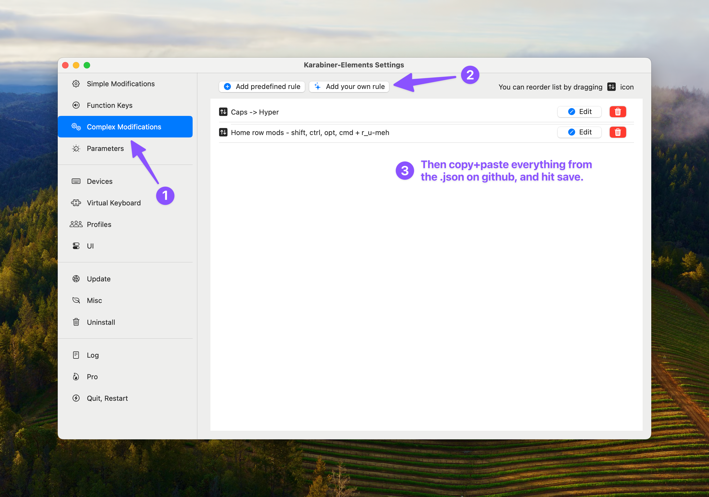
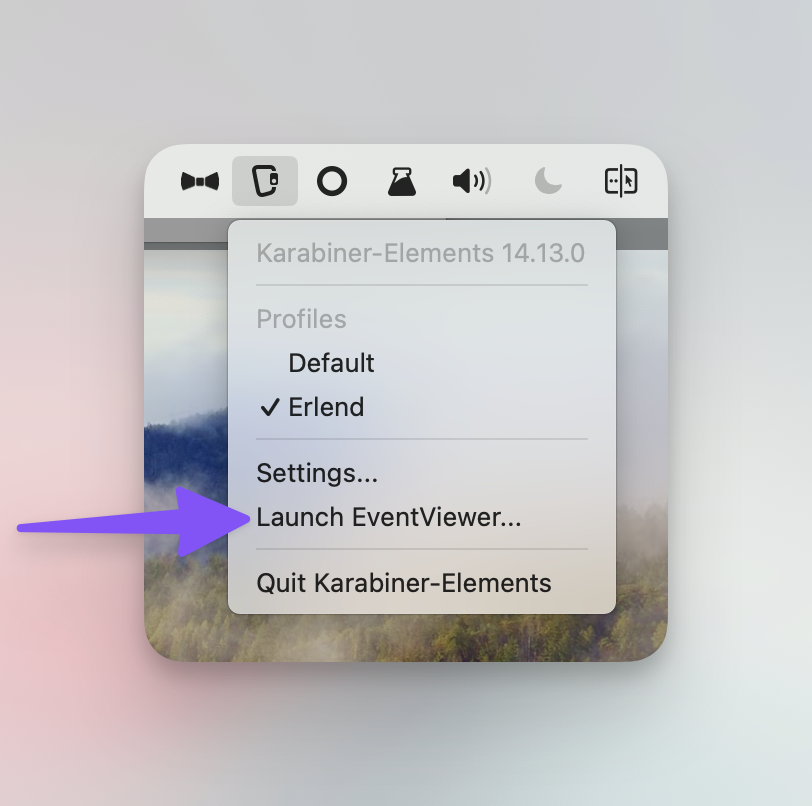

# Karabiner actions
Here are some Karabiner-element actions I've put together.

I wouldn't use those in the folders "layer" and "simlayer" - so there's two actions here:

## Home row mods
There's currently two versions of the home row action. They're both with the mod order that's on regular keyboards (and mirrored on the other side):
* A = Shift
* S = Control
* D = Option/Alt
* F = Commnd/Win
There's one version with just those mods, and one version with Meh (Shift+Control+Option) on R and U.

## How to add to Karabiner

### But remember to change settings!
There's no thresholds added to the actions, so that you can you can adjust yourself. But one value is pretty high as default, so take a look here. 👇🏻
![I've went into "Parameters", and then highighted to_if_alone and to_if_held_down. About the first, i've said: "This does the following, when on 1000 milliseconds (1 second): If you hold F for 1 second, and then release it without hitting any other buttons, F gets written. But if you hold for 1.1 secons, Command gets sent instead." And about the second, I wrote: "This starts on 500 - but I'd set it to 200, and see what you ike. It's how long you must hold F before it becomes Command. Lower value makes it possible to do hotkeys faster. But if it's too low, and you write the word "Fast" and hold F and A together for a few milliseconds, you wil send "Comman + A"." ](images/Karabiner-settings.png)

While testing, it could be a good idea to use Karabiner's EventViewer.

Good luck! 🤗

-Erlend
