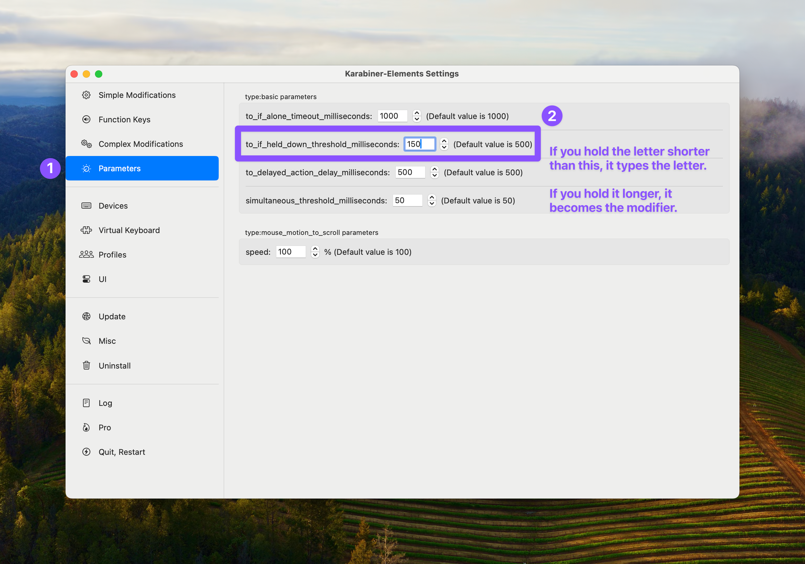

# Karabiner actions
Here are some Karabiner-element actions I've put together.

I wouldn't use those in the folders "layer" and "simlayer" - so there's two actions here:

## Home row mods
There's currently two versions of the home row action. They're both with the mod order that's on regular keyboards (and mirrored on the other side):
* A = Shift
* S = Control
* D = Option/Alt
* F = Commnd/Win
There's one version with just those mods, and one version with Meh (Shift+Control+Option) on R and U.

## How to add to Karabiner

### But remember to change settings!
There's no thresholds added to the actions, so that you can you can adjust yourself. But one value is pretty high as default, so take a look here. 👇🏻
